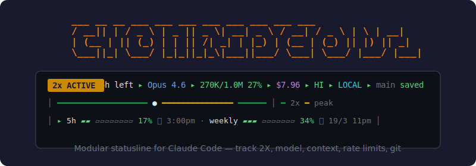
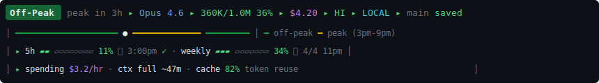

<div align="center">



# claude-2x-statusline

### v2.1 &mdash; Modular Statusline for Claude Code

Peak hours &bull; Rate limits &bull; Burn rate &bull; Context &bull; Git &mdash; all live, all auto-updating.

[](LICENSE)
[](#installation--30-seconds)
[](#engines-auto-detected)
[](#)

**[Live Preview & Tier Picker](https://statusline.nvision.me)** &nbsp;&bull;&nbsp; by [Nadav Fux](https://github.com/Nadav-Fux)

<br>

</div>

---

<div dir="rtl" align="right">

## עברית

### מה זה?

תוסף ל-Claude Code שמציג **שורת סטטוס חיה** בתחתית הטרמינל.
רואים במבט אחד: האם עכשיו שעות עומס, כמה context נשאר, מה ה-rate limit, כמה עולה הסשן, ומה מצב ה-git.

**הקילר-פיצ'ר:** שעות העומס מתעדכנות אוטומטית מ-GitHub &mdash; אם Anthropic ישנו את המדיניות, אתה מקבל את העדכון בלי לגעת בתוסף.

### 3 רמות תצוגה

<div dir="ltr" align="left">

**Minimal** &mdash; שורה אחת, מינימלי ונקי:


פיק/לא-פיק, מודל, אחוז context, אחוז מכסה 5 שעות, סביבה, git.

**Standard** &mdash; 2 שורות, כולל עלות ו-rate limits:


טוקנים מפורטים, עלות סשן, ושורה שנייה עם ברי rate limit גרפיים וזמני איפוס.

**Full** (מומלץ) &mdash; 4 שורות, דשבורד מלא:



שורה 1: סטטוס נקי. שורה 2: ציר זמן ויזואלי. שורה 3: ברי rate limit. שורה 4: קצב שריפה, זמן עד שה-context ייגמר, ואחוז cache.

</div>

### התקנה &mdash; 30 שניות

**הדרך הכי קלה &mdash; תגיד ל-Claude:**

<div dir="ltr" align="left">

```
תתקין לי את claude-2x-statusline מ-github.com/Nadav-Fux/claude-2x-statusline
```

</div>

Claude יריץ clone, install, ישאל איזה רמה אתה רוצה, ויגדיר הכל.

**או שורה אחת בטרמינל:**

<div dir="ltr" align="left">

```bash
git clone https://github.com/Nadav-Fux/claude-2x-statusline.git ~/.claude/cc-2x-statusline && bash ~/.claude/cc-2x-statusline/install.sh
```

</div>

### שינוי רמה

<div dir="ltr" align="left">

| פקודה | מה עושה |
|-------|---------|
| `/statusline-minimal` | עובר ל-Minimal |
| `/statusline-standard` | עובר ל-Standard |
| `/statusline-full` | עובר ל-Full (מומלץ) |

</div>

### שעות עומס (Peak Hours)

Anthropic מגבילה את קצב הצריכה של מכסת ה-5 שעות בשעות שיא. **שימו לב:** Peak = צריכה מהירה יותר של המכסה. Off-Peak = צריכה רגילה.

<div dir="ltr" align="left">

| מתי | סטטוס | שעון Pacific |
|------|:------:|:-------------|
| ימי חול, שעות שיא | **Peak** | 5:00am &ndash; 11:00am PT |
| שאר השעות | Off-Peak | &mdash; |
| סופ"ש (שבת + ראשון) | Off-Peak | כל היום |

</div>

השעות מתורגמות **אוטומטית** לאזור הזמן שלך (ישראל, ארה"ב, אירופה, אוסטרליה &mdash; כולל שעון קיץ/חורף).

> **חשוב:** מכסות שבועיות לא משתנות. רק הקצב שבו מכסת ה-5 שעות נצרכת עולה בזמן Peak.

### עדכון אוטומטי מרחוק

התוסף מושך קובץ `schedule.json` מ-GitHub כל 6 שעות. אם Anthropic משנים את שעות העומס, אני מעדכן את הקובץ ב-repo &mdash; וכל המשתמשים מקבלים את העדכון **אוטומטית**, בלי `git pull`, בלי התקנה מחדש.

### דרישות

<div dir="ltr" align="left">

- Claude Code (עם תמיכה ב-statusline)
- **אחד מ:** Python 3 | Node.js | PowerShell 5.1+ | Bash

</div>

</div>

---

<br>

## English

### What is this?

A modular statusline plugin for Claude Code that shows a **live dashboard** at the bottom of your terminal. At a glance you see: peak hours status, model info, context usage, rate limits, session cost, burn rate, cache efficiency, and git status.

**The killer feature:** Peak hours schedule auto-updates from GitHub. When Anthropic changes their policy, the maintainer updates one JSON file and every user gets the new schedule automatically &mdash; no `git pull`, no reinstall.

---

## What It Looks Like

### Minimal &mdash; 1 line


Peak status, model, context %, 5-hour limit %, environment, and git.

### Standard &mdash; 2 lines


Full token counts, session cost, and a second line with graphical rate limit bars and reset times.

### Full &mdash; 4 lines (recommended)


Line 1: Clean status bar. Line 2: Visual timeline of peak/off-peak. Line 3: Rate limit bars with resets. Line 4: Burn rate ($/hr), context depletion estimate, and cache hit ratio.

The **Peak** badge turns **red** (lots of peak time left), **yellow** (1-2 hours remaining), or **green** (under 30 min &mdash; almost over), with a countdown showing exactly when peak ends.

---

## Installation &mdash; 30 Seconds

### Option 1: Ask Claude (easiest)

Paste this into Claude Code:

```
Install the claude-2x-statusline plugin from github.com/Nadav-Fux/claude-2x-statusline
```

Claude will clone the repo, run the installer, ask which tier you want, and configure everything. Restart Claude Code when done.

### Option 2: One-liner

**macOS / Linux:**

```bash
git clone https://github.com/Nadav-Fux/claude-2x-statusline.git ~/.claude/cc-2x-statusline && bash ~/.claude/cc-2x-statusline/install.sh
```

**Windows (PowerShell):**

```powershell
irm https://raw.githubusercontent.com/Nadav-Fux/claude-2x-statusline/main/install.ps1 | iex
```

The installer asks which tier you want, writes the config, updates `settings.json`, installs slash commands, and fetches the initial peak hours schedule. **Restart Claude Code to activate.**

---

## 3 Tiers

> **Recommendation:** Start with **Full**. You get everything &mdash; timeline, rate limits, burn rate, cache stats. You can always switch down.

| Tier | Lines | What you see | Best for |
|:-----|:-----:|:-------------|:---------|
| **Minimal** | 1 | Peak status, model, CTX%, 5H%, env, git | Clean and focused |
| **Standard** | 2 | + full token counts, cost, rate limit bars with resets | Daily use |
| **Full** | 4 | + timeline visualization, burn rate, context depletion, cache % | **Recommended** |

### Switch Anytime

Use slash commands inside Claude Code:

| Command | Effect |
|:--------|:-------|
| `/statusline-minimal` | Switch to Minimal (1 line) |
| `/statusline-standard` | Switch to Standard (2 lines) |
| `/statusline-full` | Switch to Full dashboard (4 lines) |

Or edit the config directly:

```bash
# Config file location:
~/.claude/statusline-config.json
```

```json
{
  "tier": "full",
  "schedule_url": "https://raw.githubusercontent.com/Nadav-Fux/claude-2x-statusline/main/schedule.json",
  "schedule_cache_hours": 6
}
```

---

## What Everything Means

### Main Status Line

```
 Off-Peak  ▸ peak in 3h 22m ▸ Opus 4.6 ▸ 360K/1.0M 36% ▸ $4.20 ▸ REMOTE ▸ main 2 unsaved
 ╰─ peak ─╯  ╰─ countdown ─╯  ╰ model ╯  ╰── context ──╯  ╰ $$ ╯  ╰ env ╯  ╰─── git ───╯
```

| Segment | What it shows | Details |
|:--------|:-------------|:--------|
| `Off-Peak` / `Peak` | Current peak status | Green = Off-Peak (normal). Red/yellow = Peak (limits consumed faster) |
| `peak in 3h 22m` | Countdown | Time until the next peak window starts (or ends, during peak) |
| `3pm-9pm` | Peak window | Peak hours converted to your local timezone |
| `Opus 4.6` | Active model | The model Claude Code is currently using |
| `360K/1.0M 36%` | Context usage | Tokens used / window size and percentage |
| `$4.20` | Session cost | Total cost in USD for this session |
| `LOCAL` / `REMOTE` | Environment | Cyan = local machine. Magenta = SSH/remote server |
| `main` | Git branch | Current branch name |
| `saved` / `2 unsaved` | Git status | Green "saved" = clean. Yellow = uncommitted changes |

### Conditional Segments (appear only when active)

| Segment | When it appears |
|:--------|:---------------|
| `NORMAL` / `INSERT` | Vim mode is active in Claude Code |
| Agent name | Running inside a subagent |
| `wt:name` | Running inside a git worktree |

### Rate Limits (Standard + Full)

```
│ ▸ 5h ▰▰▱▱▱▱▱▱▱▱ 20% ⟳ 5:00pm · weekly ▰▰▰▰▱▱▱▱▱▱ 42% ⟳ 4/4 11:00pm │
```

| Part | Meaning |
|:-----|:--------|
| `5h` | 5-hour rolling window limit |
| `▰▰▱▱▱▱▱▱▱▱ 20%` | Graphical bar + percentage consumed |
| `⟳ 5:00pm` | When this limit resets (local time) |
| `⚡ peak` | Appears during peak &mdash; consumption rate is higher |
| `weekly` | Weekly limit (does not change during peak) |
| `⟳ 4/4 11:00pm` | Weekly reset date and time |

### Spending & Cache (Full only)

```
│ spending $3.2/hr · ctx full ~47m · cache 82% │
```

| Part | Meaning |
|:-----|:--------|
| `spending $3.2/hr` | Current burn rate in dollars per hour |
| `ctx full ~47m` | Estimated time until context window is full (red < 30m, yellow < 60m) |
| `cache 82%` | Token cache hit ratio (green >= 80%, yellow >= 50%, red < 50%) |

### Timeline (Full only)

```
│ ━━━━━━━━━━━━━━━━━━━●━━━━━━━━━━━━━━━━━━━━━━━━ │  ━ off-peak  ━ peak (3pm-9pm)
```

A visual representation of today's peak/off-peak windows with a marker showing where you are now. The legend shows the peak hours in your local timezone.

---

## Color Guide

| Color | Where | Meaning |
|:------|:------|:--------|
| Green | Peak badge | Off-Peak &mdash; normal rate |
| Red | Peak badge | Deep into peak hours (lots of time left) |
| Yellow | Peak badge | Peak ending soon (1-2 hours) |
| Green | Peak badge | Peak almost over (< 30 minutes) |
| Green | Git status | Clean &mdash; all saved |
| Yellow | Git status | Uncommitted changes |
| Cyan | Environment | LOCAL |
| Magenta | Environment | REMOTE (SSH) |
| Green | Cache % | Excellent reuse (>= 80%) |
| Yellow | Cache % | Moderate reuse (>= 50%) |
| Red | Cache % | Low reuse / context depletion warning |
| Green | Separators (▸) | Off-Peak |
| Yellow | Separators (▸) | During Peak |

---

## Peak Hours &mdash; How It Works

Anthropic's rate limiting policy adjusts **5-hour session limit** consumption during peak hours. This does **not** change your weekly limit &mdash; only how fast the 5-hour window quota is consumed.

| When | Status | Pacific Time | Your time |
|:-----|:------:|:-------------|:----------|
| Weekdays, peak hours | **Peak** | 5:00 AM &ndash; 11:00 AM PT | Auto-converted to local |
| Weekdays, other hours | Off-Peak | &mdash; | &mdash; |
| Weekends (Sat & Sun) | Off-Peak | All day | &mdash; |

> **Key insight:** Peak = bad for heavy usage. Your 5-hour limit gets consumed faster. If you have limit-intensive work, consider scheduling it for Off-Peak hours.

### Auto-Timezone

The plugin detects your timezone automatically and converts peak hours to your local time. Handles DST transitions worldwide &mdash; Israel, US (all zones), Europe, Australia, Japan, and everywhere else.

**Examples of the same peak window in different timezones:**

| Timezone | Peak window displayed as |
|:---------|:------------------------|
| US Pacific (PT) | 5:00 AM &ndash; 11:00 AM |
| US Eastern (ET) | 8:00 AM &ndash; 2:00 PM |
| Israel (IST) | 3:00 PM &ndash; 9:00 PM |
| Central Europe (CET) | 2:00 PM &ndash; 8:00 PM |
| Australia East (AEST) | 11:00 PM &ndash; 5:00 AM (+1) |

---

## Remote Schedule &mdash; Auto-Updating

This is the core innovation of the plugin. Instead of hardcoding peak hours, the plugin fetches a `schedule.json` file from GitHub:

```
https://raw.githubusercontent.com/Nadav-Fux/claude-2x-statusline/main/schedule.json
```

**How it works:**

1. Every **6 hours**, the plugin checks for a new schedule (configurable via `schedule_cache_hours`)
2. The fetched schedule is cached locally at `~/.claude/statusline-schedule.json`
3. If the fetch fails, the cached version is used
4. If no cache exists, a hardcoded fallback is used
5. The schedule controls: peak hours, labels, feature flags, and optional banner messages

**What this means for you:** If Anthropic changes peak hours from 5-11 AM to 6 AM-12 PM, or adds weekend peaks, or removes peak hours entirely &mdash; the maintainer updates `schedule.json` on GitHub and your statusline reflects the change on the next refresh. Zero action required from you.

**What the schedule controls:**

| Field | Purpose |
|:------|:--------|
| `peak.start` / `peak.end` | Peak hour range (in PT) |
| `peak.days` | Which days have peak hours (1=Mon, 7=Sun) |
| `peak.label_peak` / `peak.label_offpeak` | Display labels |
| `default_tier` | Recommended tier for new installs |
| `banner.text` | Optional announcement shown to all users |
| `banner.expires` | Auto-expiry date for the banner |
| `features.*` | Toggle segments on/off remotely |

---

## Engines (Auto-Detected)

The plugin ships with 4 engine implementations. The wrapper script auto-detects the best available runtime:

| Priority | Engine | Platform | Dependencies |
|:--------:|:-------|:---------|:-------------|
| 1 | **Python** | macOS, Linux, Windows | Python 3 (no pip packages) |
| 2 | **Node.js** | All | Node.js |
| 3 | **Bash** | macOS, Linux | None |
| 4 | **PowerShell** | Windows | PowerShell 5.1+ (built-in) |

Detection order: Python &rarr; Node.js &rarr; Bash. On Windows, PowerShell is used directly. All engines produce identical output.

---

## File Layout

```
~/.claude/cc-2x-statusline/
  statusline.sh          # Entry point (engine selector)
  statusline.ps1         # Windows entry point
  engines/
    python-engine.py     # Primary engine (full features)
    node-engine.js       # Node.js engine
    bash-engine.sh       # Pure bash fallback
  commands/
    statusline-minimal.md
    statusline-standard.md
    statusline-full.md
    statusline-tier.md
  skills/                # Slash command skill definitions
  schedule.json          # Bundled schedule (fallback)
  plugin.json            # Plugin metadata
  install.sh             # Interactive installer
  install.ps1            # Windows installer
  uninstall.sh           # Clean uninstaller

~/.claude/
  statusline-config.json    # Your config (tier, schedule URL)
  statusline-schedule.json  # Cached remote schedule
  settings.json             # Claude Code settings (statusLine entry)
```

---

## Debug

```bash
STATUSLINE_DEBUG=1 echo '{}' | bash ~/.claude/cc-2x-statusline/statusline.sh
```

This runs the statusline with debug output to stderr, showing config loading, schedule resolution, timezone detection, and segment rendering.

## Uninstall

```bash
bash ~/.claude/cc-2x-statusline/uninstall.sh
```

Removes the plugin files, config, cached schedule, and the `statusLine` entry from `settings.json`.

---

## For Claude Code Agents

If you are a Claude Code instance and a user asks you to install this plugin, here is the procedure:

1. Clone: `git clone https://github.com/Nadav-Fux/claude-2x-statusline.git ~/.claude/cc-2x-statusline`
2. Run: `bash ~/.claude/cc-2x-statusline/install.sh` (or follow the manual steps below)
3. The installer will ask which tier the user wants (default: Full)
4. Tell the user to restart Claude Code

**Manual install (if the interactive installer is not suitable):**

```bash
# Copy files
mkdir -p ~/.claude/cc-2x-statusline
cp -r /path/to/repo/* ~/.claude/cc-2x-statusline/
chmod +x ~/.claude/cc-2x-statusline/statusline.sh

# Write config
cat > ~/.claude/statusline-config.json << 'EOF'
{
  "tier": "full",
  "schedule_url": "https://raw.githubusercontent.com/Nadav-Fux/claude-2x-statusline/main/schedule.json",
  "schedule_cache_hours": 6
}
EOF

# Update settings.json to register the statusline
python3 -c "
import json
p = '$HOME/.claude/settings.json'
with open(p) as f: s = json.load(f)
s['statusLine'] = {'type': 'command', 'command': 'bash $HOME/.claude/cc-2x-statusline/statusline.sh'}
with open(p, 'w') as f: json.dump(s, f, indent=2)
"

# Install slash commands
cp ~/.claude/cc-2x-statusline/commands/statusline-*.md ~/.claude/commands/
```

---

<div align="center">

**[Live Preview & Tier Picker](https://statusline.nvision.me)** &nbsp;&bull;&nbsp; [MIT License](LICENSE) &nbsp;&bull;&nbsp; by [Nadav Fux](https://github.com/Nadav-Fux)

</div>
