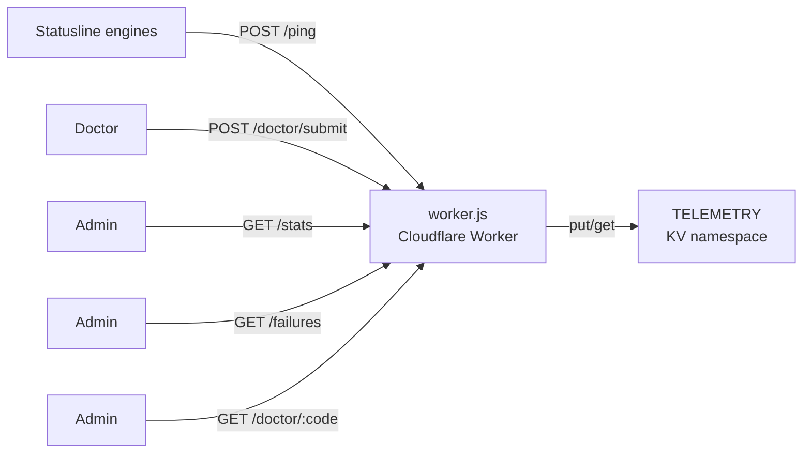

# Telemetry worker

## Purpose

A Cloudflare Worker that receives anonymous telemetry pings from installed statuslines, stores them in KV, and serves aggregated statistics. Deployed at `https://statusline-telemetry.nadavf.workers.dev`.

## Architecture



## Endpoints

| Method | Path | Auth | Purpose |
|--------|------|------|---------|
| POST | `/ping` | None | Anonymous telemetry (install/heartbeat/doctor summary) |
| GET | `/stats` | Token | Aggregated stats (DAU, installs, engine/tier/OS breakdown) |
| GET | `/failures` | Token | Install/update/doctor failure rollups |
| POST | `/doctor/submit` | None | Rich doctor diagnostics (anonymous, 30-day TTL) |
| GET | `/doctor/:code` | Token | Fetch reports for a machine code |
| GET | `/doctor/:code/latest` | Token | Most recent report as plain text |

## KV data model

The worker uses a single KV namespace (`TELEMETRY`) with these key patterns:

| Key pattern | Value | TTL |
|-------------|-------|-----|
| `dau:YYYY-MM-DD:<id>` | `engine:tier:os:version` | 90 days |
| `install:<id>` | `YYYY-MM-DD:engine:tier:os:version` | Permanent |
| `event:<id>:<timestamp>` | Event record (doctor, install_result, update) | 90 days |
| `doctor:<id>:<timestamp>` | Sanitized diagnostic report | 30 days |
| `_auth_token` | Admin authentication secret | Permanent |

## Request handling

The worker validates the `id` field as a hex string (8-32 chars). The `failed_ids` array is normalized and stored for failure tracking. Install events are first-seen only (existing key check before write).

The `/stats` endpoint aggregates DAU by iterating today's `dau:*` keys, grouping by engine, tier, and OS.

## Deployment

```bash
cd worker
wrangler deploy
wrangler kv key put --binding=TELEMETRY _auth_token "your-secret-here"
```

Configuration in `worker/wrangler.toml`:

```toml
name = "statusline-telemetry"
main = "worker.js"
compatibility_date = "2024-01-01"

[[kv_namespaces]]
binding = "TELEMETRY"
id = "5a5df3f52f9946ec981c173d2c6d520d"
```

## Privacy

All submissions are sanitized client-side before upload. The worker does not accept conversation data, file contents, or API keys. Doctor reports auto-delete after 30 days. See [telemetry](../features/telemetry.md) for the client-side privacy model.

## Key source files

| File | Lines | Purpose |
|------|-------|---------|
| `worker/worker.js` | 432 | Cloudflare Worker implementation |
| `worker/wrangler.toml` | 8 | Deployment configuration |
| `worker/worker.test.mjs` | 150 | Unit tests for all endpoints |
| `worker/package.json` | 6 | Package metadata |
| `worker/README.md` | 40 | Deployment and endpoint documentation |

## Related pages

- [Telemetry](../features/telemetry.md) — Client-side telemetry system
- [Security](../security.md) — Privacy and data sanitization model
