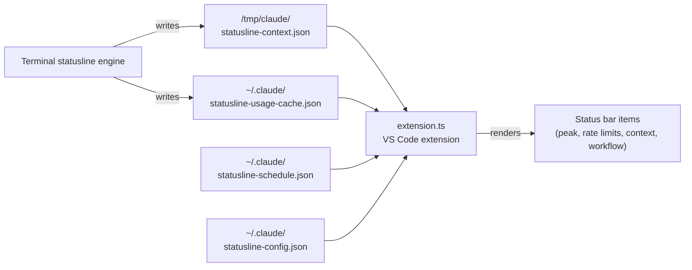

# VS Code extension

## Purpose

A TypeScript extension that renders peak hours, rate limits, context window, and effort level in the VS Code status bar. Works in any VS Code-based editor: VS Code, Cursor, Windsurf, and Antigravity.

## Architecture

The extension reads live data from files that the terminal statusline writes to disk:



## Status bar items

The extension creates four status bar items:

| Item | Content | Update trigger |
|------|---------|----------------|
| Peak | Peak/Off-Peak badge with countdown | Schedule fetch + timer |
| Rate limits (5h) | Battery bar with percentage | Usage cache poll |
| Rate limits (weekly) | Battery bar with percentage | Usage cache poll |
| Context | Context window percentage | Context file poll |
| Workflow | Active workflow agent count | Context file poll |

## Data sources

The extension reads from these files:

| File | Writer | Content |
|------|--------|---------|
| `/tmp/claude/statusline-context.json` | Terminal engine | Model, context usage, workflow agents |
| `~/.claude/statusline-usage-cache.json` | Terminal engine | Rate limit utilization (5h, weekly) |
| `~/.claude/statusline-config.json` | Installer/user | Tier, refresh interval |
| `~/.claude/statusline-schedule.json` | Terminal engine | Cached schedule |
| `~/.claude/.credentials.json` | Claude Code | OAuth token for rate limit API |
| `~/.claude/settings.json` | Claude Code | Settings including auth mode |

## Rate limit API

The extension calls Anthropic's OAuth API to fetch rate limit utilization when credentials are available. It caches results at `~/.claude/statusline-usage-cache.json` with a configurable refresh interval (default 30 seconds).

## Color coding

| Color | Meaning |
|-------|---------|
| Teal | Healthy (low usage, off-peak) |
| Yellow (warning background) | Moderate (50-79% usage, peak hours) |
| Red (error background) | Critical (80%+ usage) |

## Configuration

User-configurable settings (in VS Code settings.json):

```json
{
  "claudeStatusline.tier": "auto",
  "claudeStatusline.refreshInterval": 30,
  "claudeStatusline.showRateLimits": true,
  "claudeStatusline.showPeakHours": true
}
```

The `auto` tier reads from `~/.claude/statusline-config.json`.

## Building

```bash
cd vscode
npm install
npm run compile       # TypeScript → JavaScript
npm run package       # Build .vsix for installation
```

The extension is published as `claude-statusline` by `nvision-digital`. The installer detects supported editors and installs the extension automatically.

## Key source files

| File | Lines | Purpose |
|------|-------|---------|
| `vscode/extension.ts` | 743 | Main extension implementation |
| `vscode/package.json` | 60 | Extension manifest and configuration schema |
| `vscode/tsconfig.json` | 12 | TypeScript configuration |

## Related pages

- [Statusline tiers](../features/statusline-tiers.md) — Shared tier system
- [Peak hours and schedule](../features/peak-hours-schedule.md) — Schedule data source
- [Installer pipeline](../systems/installer.md) — How the extension gets installed
