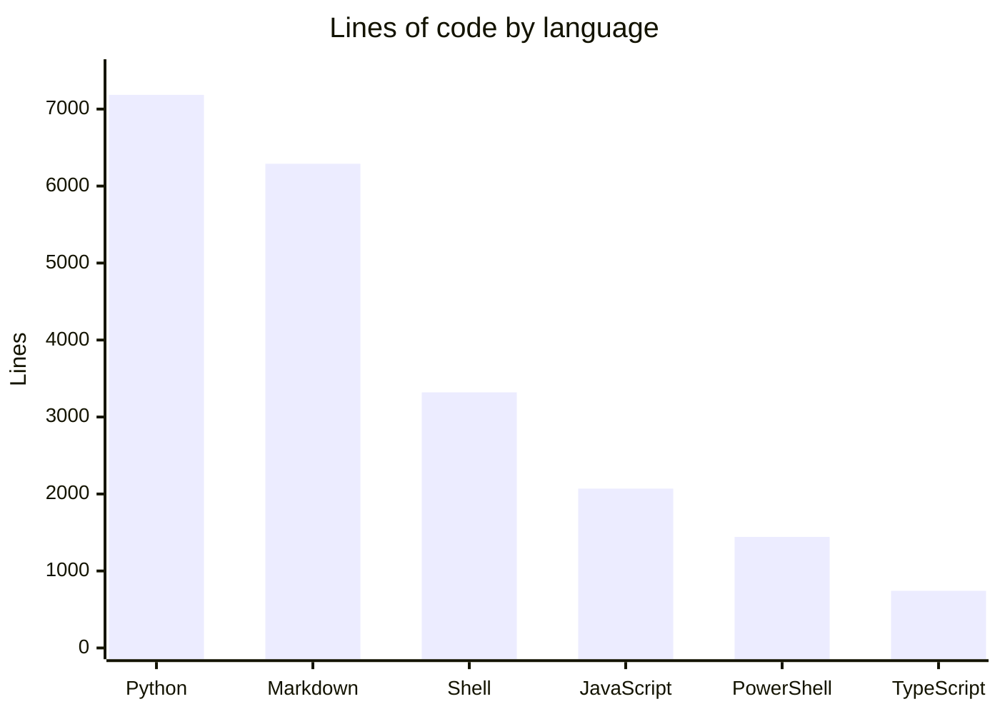

# By the numbers

Data collected on June 14, 2026.

## Size

| Metric | Value |
|--------|-------|
| Total source files | 128 |
| Total lines (all files) | ~25,851 |
| Python lines | 7,185 |
| Markdown lines | 6,290 |
| Shell/Bash lines | 3,320 |
| JavaScript lines | 2,070 |
| PowerShell lines | 1,442 |
| TypeScript lines | 742 |
| JSON lines | 4,399 |
| Test files | 23 |
| Slash commands | 11 |
| Skills | 5 |

## Complexity

| Metric | Value |
|--------|-------|
| Largest source file | `engines/python-engine.py` (1,670 lines) |
| Second largest | `doctor/doctor.sh` (1,338 lines) |
| Third largest | `narrator/scoring.py` (435 lines) |
| Largest test file | `tests/test_narrator_scoring.py` (622 lines) |
| Total test count | 138 Python tests + 8 Node.js tests |

## Directory breakdown

| Directory | Files | Primary language | Role |
|-----------|-------|-----------------|------|
| `engines/` | 3 | Python, JS, Bash | Statusline renderers |
| `lib/` | 6 | Python, JS, Bash, PS1 | Shared libraries |
| `narrator/` | 8 | Python, JS | Insight narrator |
| `doctor/` | 2 | Bash | Diagnostics |
| `hooks/` | 3 | Bash, JSON | Claude Code hooks |
| `commands/` | 11 | Markdown | Slash commands |
| `skills/` | 5 | Markdown | Claude Code skills |
| `worker/` | 5 | JavaScript | Telemetry worker |
| `vscode/` | 7 | TypeScript | VS Code extension |
| `tests/` | 23 | Python, JS | Test suite |
| `docs/` | 14 | Markdown | Changelogs and reports |

## Activity

The git history was squashed into 2 commits, so per-commit metrics are not meaningful. The `docs/changelog/` directory provides the real development timeline with 12 changelog entries spanning April 19 to May 2, 2026.

## Bot-attributed commits

Both commits in the squashed history show no bot co-authorship. The development appears to be entirely human-authored based on git metadata.
