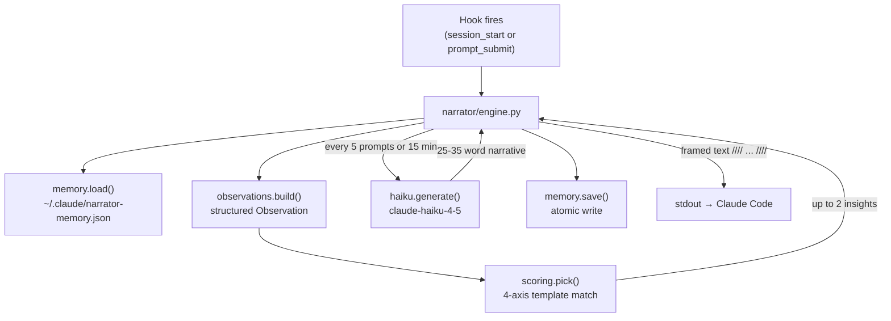

# Narrator

## Purpose

The narrator is a hook-injected insight system that surfaces plain-language context-management advice above the user's next prompt. It reads the same metrics the statusline displays and tells the user what those numbers mean and what to do about them.

## Two-layer architecture



### Layer 1: Rules engine

Always active, sub-50ms execution, zero cost. The scoring system in `narrator/scoring.py` evaluates templates against the current [Observation](#observation-dataclass) and returns up to 2 `Insight` objects.

Each insight is scored on 4 axes:

| Axis | Weight | Range | Meaning |
|------|--------|-------|---------|
| Urgency | x3 | 10=critical, 7=warning, 4=info, 1=fallback | How time-sensitive |
| Novelty | x2 | 10=not seen recently, 0=repeated | Dedup against last 3 narratives |
| Actionability | x2 | 10=strong action, 5=info+suggestion, 2=pure info | Can the user act on it |
| Uniqueness | x1 | 10=novel fact, 5=adds meaning, 0=restatement | Is this new information |

Final score: `urgency * 3 + novelty * 2 + actionability * 2 + uniqueness * 1`. The top 2 insights by score are surfaced.

Templates cover 15+ patterns: context filling up, high burn rate, cache activity, rate limits approaching, cost milestones ($5/$10/$25/$50/$100), peak/off-peak transitions.

### Layer 2: Haiku LLM

Optional, fires when `ANTHROPIC_API_KEY` is set. Uses `claude-haiku-4-5` with a 5-second timeout and 80-token max output. The system prompt instructs it to write 25-35 words covering what changed since the last report and the bigger session picture.

Firing conditions: every 5 prompts or 15 minutes (whichever comes first), plus always on session start, compact, or resume. Cost: approximately $0.0005 per call.

The Haiku layer receives the rules engine's pick as context, so it does not repeat what the rules already said.

## Observation dataclass

The `Observation` in `narrator/observations.py` is the single source of truth fed to both scoring and Haiku:

```python
@dataclass
class Observation:
    cost_usd: float           # session cumulative cost
    burn_10m: float | None    # $/hr rolling 10-min window
    burn_session: float | None  # $/hr lifetime session average
    ctx_pct: float            # 0-100% of context used
    ctx_mins_left: float | None  # minutes until context full
    cache_pct: float          # cache_read / total_input * 100
    cache_delta_5m: int | None  # cache_read tokens in last 5 min
    is_peak: bool             # peak hours active
    rate_limit_5h_pct: float  # 5-hour limit utilization
    rate_limit_7d_pct: float  # weekly limit utilization
    session_duration_min: float
    prompt_count: int
    # ... plus trend deltas (cost_delta_5m, cost_delta_20m, ctx_delta_5m)
```

## Memory and cross-session continuity

State persists at `~/.claude/narrator-memory.json` with this shape:

```json
{
  "current": {
    "session_id": "...",
    "started_at": 1718400000,
    "last_emit_at": 1718400300,
    "last_haiku_at": 1718400600,
    "rolling_observations": [...],
    "delivered_narratives": [...],
    "cost_milestones_hit": [5.0, 10.0],
    "prompt_count": 42
  },
  "prior_sessions": [
    { "session_id": "...", "ended_at": ..., "narratives": [...] }
  ]
}
```

Observations are kept for 2 hours. Delivered narratives are capped at 8 per session. Prior sessions keep the last 3 with top-5 narratives each. Session rotation happens when `CLAUDE_SESSION_ID` changes.

## Novelty dedup

The `_novelty()` function in `narrator/scoring.py` checks whether a template has fired in the last 3 delivered narratives. If it has, novelty drops to 0, which effectively suppresses repetition since novelty carries weight x2 in the score.

## Bilingual support

All templates carry both `text` (English) and `text_he` (Hebrew). Language detection:

1. `STATUSLINE_NARRATOR_LANGS=en` / `=he` / `=en,he` (explicit override)
2. `$LC_ALL` / `$LC_MESSAGES` / `$LANG` starting with `he` → Hebrew
3. Default: English

Output is wrapped in `//// -> text ////` framing for visual distinction from normal prompt context.

## Node.js parity

`narrator/narrator-node.js` (551 lines) is a complete port of the Python narrator into a single self-contained module. It reimplements memory, observations, scoring, and Haiku calling. The shell hooks try Python first, then fall back to Node.js.

## Throttling

- `prompt_submit` mode: minimum 5 minutes between emits (configurable via `STATUSLINE_NARRATOR_THROTTLE_MIN`)
- `session_start` mode: always emits (no throttle)
- `/narrate` command: manual trigger, bypasses throttle

## Environment variables

| Variable | Default | Effect |
|----------|---------|--------|
| `STATUSLINE_NARRATOR_ENABLED` | `1` | Kill switch (`0` disables) |
| `STATUSLINE_NARRATOR_HAIKU` | `auto` | `auto` = on if API key exists |
| `STATUSLINE_NARRATOR_HAIKU_INTERVAL_MIN` | `15` | Max minutes between Haiku calls |
| `STATUSLINE_NARRATOR_THROTTLE_MIN` | `5` | Min minutes between prompt_submit emits |
| `STATUSLINE_NARRATOR_LANGS` | auto-detect | `en`, `he`, or `en,he` |
| `ANTHROPIC_API_KEY` | unset | Enables Haiku layer when present |

## Key source files

| File | Purpose |
|------|---------|
| `narrator/engine.py` | Pipeline orchestrator: load memory, build obs, score, Haiku, persist |
| `narrator/scoring.py` | 4-axis scoring, 15+ templates, novelty dedup |
| `narrator/observations.py` | Observation dataclass and builder from live session state |
| `narrator/haiku.py` | Optional Anthropic Haiku API call |
| `narrator/memory.py` | Persistent cross-session memory with atomic writes |
| `narrator/narrator-node.js` | Full Node.js port of the entire pipeline |
| `narrator/cli.js` | CLI wrapper for the Node.js narrator |
| `narrator/__init__.py` | Public API: `from narrator import run` |
| `hooks/narrator-prompt-submit.sh` | UserPromptSubmit hook dispatcher |
| `hooks/narrator-session-start.sh` | SessionStart hook dispatcher |
| `hooks/hooks.json` | Claude Code hook registration |
| `tests/test_narrator.py` | Scoring, observation, and pipeline tests |
| `tests/test_narrator_scoring.py` | Detailed scoring template tests |
| `tests/test_narrator_memory.py` | Memory persistence and rotation tests |

## Related pages

- [Rolling metrics](rolling-metrics.md) — Source data for narrator observations
- [Hooks and commands](../systems/hooks-and-commands.md) — How hooks connect to the narrator
- [Engine architecture](../systems/engines.md) — Python vs Node narrator dispatch
