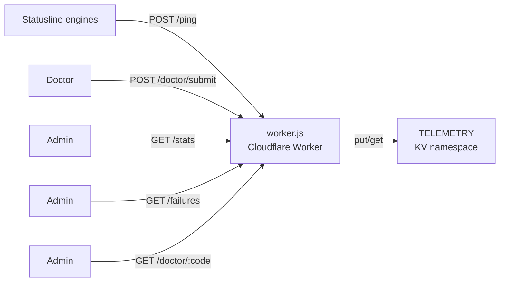

# Telemetry worker

## מטרה

Cloudflare Worker שמקבל pings טלמטריה אנונימיים מ-statuslines מותקנים, מאחסן אותם ב-KV, ומגיש סטטיסטיקות מצטברות. מתפרס בכתובת `https://statusline-telemetry.nadavf.workers.dev`.

## ארכיטקטורה



## Endpoints

| מתודה | נתיב | Auth | מטרה |
|--------|------|------|---------|
| POST | `/ping` | ללא | טלמטריה אנונימית (install/heartbeat/doctor summary) |
| GET | `/stats` | Token | סטטיסטיקות מצטברות (DAU, installs, פילוח engine/tier/OS) |
| GET | `/failures` | Token | rollups של כשלי install/update/doctor |
| POST | `/doctor/submit` | ללא | דיאגנוסטיקת doctor עשירה (אנונימית, TTL של 30 יום) |
| GET | `/doctor/:code` | Token | שליפת דוחות לפי קוד מכונה |
| GET | `/doctor/:code/latest` | Token | הדוח העדכני ביותר כטקסט רגיל |

## מודל נתונים ב-KV

ה-worker משתמש ב-namespace יחיד של KV (`TELEMETRY`) עם תבניות key אלה:

| תבנית key | ערך | TTL |
|-------------|-------|-----|
| `dau:YYYY-MM-DD:<id>` | `engine:tier:os:version` | 90 יום |
| `install:<id>` | `YYYY-MM-DD:engine:tier:os:version` | קבוע |
| `event:<id>:<timestamp>` | רשומת event (doctor, install_result, update) | 90 יום |
| `doctor:<id>:<timestamp>` | דוח דיאגנוסטי מטוהר | 30 יום |
| `_auth_token` | סוד אימות admin | קבוע |

## טיפול בבקשות

ה-worker מאמת את שדה `id` כ-hex string (8-32 תווים). מערך `failed_ids` מנורמל ומאוחסן למעקב כשלים. אירועי install נשמרים רק בראייה ראשונה (בדיקת key קיים לפני כתיבה).

ה-endpoint `/stats` מצרף DAU על ידי איטרציה על keys של היום `dau:*`, תוך קיבוץ לפי engine, tier ו-OS.

## פריסה

```bash
cd worker
wrangler deploy
wrangler kv key put --binding=TELEMETRY _auth_token "your-secret-here"
```

הגדרה ב-`worker/wrangler.toml`:

```toml
name = "statusline-telemetry"
main = "worker.js"
compatibility_date = "2024-01-01"

[[kv_namespaces]]
binding = "TELEMETRY"
id = "5a5df3f52f9946ec981c173d2c6d520d"
```

## פרטיות

כל ההגשות מטוהרות בצד הלקוח לפני upload. ה-worker אינו מקבל נתוני שיחה, תוכן קבצים או API keys. דוחות doctor נמחקים אוטומטית לאחר 30 יום. ראו [טלמטריה](../features/telemetry.md) למודל הפרטיות בצד הלקוח.

## קבצי קוד מפתח

| קובץ | שורות | מטרה |
|------|-------|---------|
| `worker/worker.js` | 432 | מימוש Cloudflare Worker |
| `worker/wrangler.toml` | 8 | הגדרת פריסה |
| `worker/worker.test.mjs` | 150 | בדיקות יחידה לכל ה-endpoints |
| `worker/package.json` | 6 | מטא-נתוני package |
| `worker/README.md` | 40 | תיעוד פריסה ו-endpoints |

## דפים קשורים

- [טלמטריה](../features/telemetry.md) — מערכת טלמטריה בצד הלקוח
- [אבטחה](../security.md) — מודל פרטיות וטיהור נתונים
