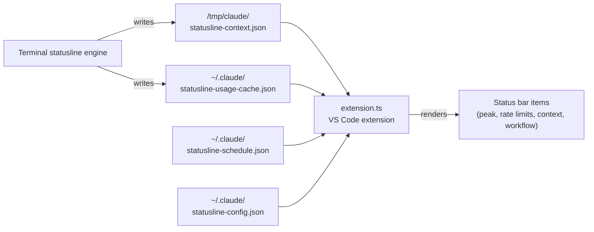

# הרחבת VS Code

## מטרה

הרחבת TypeScript שמציגה שעות peak, מגבלות קצב, חלון context ורמת מאמץ ב-status bar של VS Code. עובדת בכל עורך מבוסס VS Code: VS Code, Cursor, Windsurf ו-Antigravity.

## ארכיטקטורה

ההרחבה קוראת נתונים חיים מקבצים שה-statusline הטרמינלי כותב לדיסק:



## פריטי status bar

ההרחבה יוצרת ארבעה פריטי status bar:

| פריט | תוכן | טריגר עדכון |
|------|---------|----------------|
| Peak | תג Peak/Off-Peak עם ספירה לאחור | Fetch schedule + timer |
| מגבלות קצב (5h) | פס סוללה עם אחוז | Poll של usage cache |
| מגבלות קצב (weekly) | פס סוללה עם אחוז | Poll של usage cache |
| Context | אחוז חלון context | Poll של context file |
| Workflow | ספירת agents פעילים ב-workflow | Poll של context file |

## מקורות נתונים

ההרחבה קוראת מהקבצים הבאים:

| קובץ | כותב | תוכן |
|------|--------|---------|
| `/tmp/claude/statusline-context.json` | Terminal engine | Model, שימוש context, workflow agents |
| `~/.claude/statusline-usage-cache.json` | Terminal engine | ניצול מגבלות קצב (5h, weekly) |
| `~/.claude/statusline-config.json` | Installer/user | Tier, מרווח רענון |
| `~/.claude/statusline-schedule.json` | Terminal engine | Schedule שמור במטמון |
| `~/.claude/.credentials.json` | Claude Code | OAuth token ל-API של מגבלות קצב |
| `~/.claude/settings.json` | Claude Code | הגדרות כולל מצב auth |

## API למגבלות קצב

ההרחבה קוראת ל-OAuth API של Anthropic כדי לשלוף ניצול מגבלות קצב כאשר יש credentials זמינים. היא שומרת תוצאות במטמון ב-`~/.claude/statusline-usage-cache.json` עם מרווח רענון הניתן להגדרה (ברירת מחדל 30 שניות).

## קידוד צבע

| צבע | משמעות |
|-------|---------|
| טורקיז | תקין (שימוש נמוך, off-peak) |
| צהוב (רקע אזהרה) | מתון (50-79% שימוש, שעות peak) |
| אדום (רקע שגיאה) | קריטי (80%+ שימוש) |

## הגדרה

הגדרות הניתנות להגדרה על ידי המשתמש (ב-settings.json של VS Code):

```json
{
  "claudeStatusline.tier": "auto",
  "claudeStatusline.refreshInterval": 30,
  "claudeStatusline.showRateLimits": true,
  "claudeStatusline.showPeakHours": true
}
```

ה-tier `auto` נקרא מ-`~/.claude/statusline-config.json`.

## Build

```bash
cd vscode
npm install
npm run compile       # TypeScript → JavaScript
npm run package       # build של .vsix להתקנה
```

ההרחבה מתפרסמת כ-`claude-statusline` על ידי `nvision-digital`. ה-installer מזהה עורכים נתמכים ומתקין את ההרחבה אוטומטית.

## קבצי קוד מפתח

| קובץ | שורות | מטרה |
|------|-------|---------|
| `vscode/extension.ts` | 743 | מימוש ההרחבה הראשי |
| `vscode/package.json` | 60 | manifest של ההרחבה ו-schema ההגדרות |
| `vscode/tsconfig.json` | 12 | הגדרת TypeScript |

## דפים קשורים

- [Tiers של statusline](../features/statusline-tiers.md) — מערכת ה-tier המשותפת
- [שעות peak ו-schedule](../features/peak-hours-schedule.md) — מקור נתוני schedule
- [Pipeline ה-installer](../systems/installer.md) — כיצד ההרחבה מותקנת
