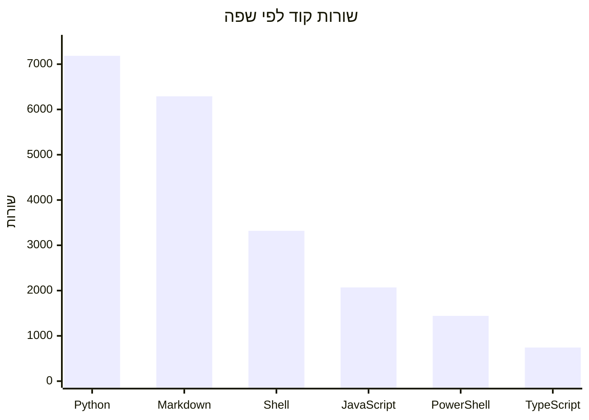

# במספרים

נתונים שנאספו ב-14 ביוני 2026.

## גודל

| מדד | ערך |
|--------|-------|
| סך כל קבצי המקור | 128 |
| סך שורות (כל הקבצים) | ~25,851 |
| שורות Python | 7,185 |
| שורות Markdown | 6,290 |
| שורות Shell/Bash | 3,320 |
| שורות JavaScript | 2,070 |
| שורות PowerShell | 1,442 |
| שורות TypeScript | 742 |
| שורות JSON | 4,399 |
| קבצי בדיקה | 23 |
| פקודות Slash | 11 |
| Skills | 5 |

## מורכבות

| מדד | ערך |
|--------|-------|
| קובץ המקור הגדול ביותר | `engines/python-engine.py`‏ (1,670 שורות) |
| השני בגודלו | `doctor/doctor.sh`‏ (1,338 שורות) |
| השלישי בגודלו | `narrator/scoring.py`‏ (435 שורות) |
| קובץ הבדיקה הגדול ביותר | `tests/test_narrator_scoring.py`‏ (622 שורות) |
| סך כל הבדיקות | 138 בדיקות Python + 8 בדיקות Node.js |

## פירוט לפי תיקיות

| תיקייה | קבצים | שפה עיקרית | תפקיד |
|-----------|-------|-----------------|------|
| `engines/` | 3 | Python, JS, Bash | מנועי רינדור שורת הסטטוס |
| `lib/` | 6 | Python, JS, Bash, PS1 | ספריות משותפות |
| `narrator/` | 8 | Python, JS | מנוע תובנות ה־narrator |
| `doctor/` | 2 | Bash | אבחון |
| `hooks/` | 3 | Bash, JSON | Hooks של Claude Code |
| `commands/` | 11 | Markdown | פקודות Slash |
| `skills/` | 5 | Markdown | Skills של Claude Code |
| `worker/` | 5 | JavaScript | Worker לטלמטריה |
| `vscode/` | 7 | TypeScript | תוסף VS Code |
| `tests/` | 23 | Python, JS | סוויטת בדיקות |
| `docs/` | 14 | Markdown | יומני שינויים ודוחות |

## פעילות

היסטוריית ה־git נדחסה ל-2 commits, כך שמדדים לפי commit אינם משמעותיים. תיקיית `docs/changelog/` מספקת את ציר הזמן האמיתי של הפיתוח עם 12 ערכי changelog המשתרעים מ-19 באפריל עד 2 במאי 2026.

## Commits המיוחסים לבוטים

שני ה־commits בהיסטוריה הדחוסה אינם מציגים שותפות עם בוט. על פי המטא-נתונים ב־git, הפיתוח נראה כולו מעשה ידי אדם.
