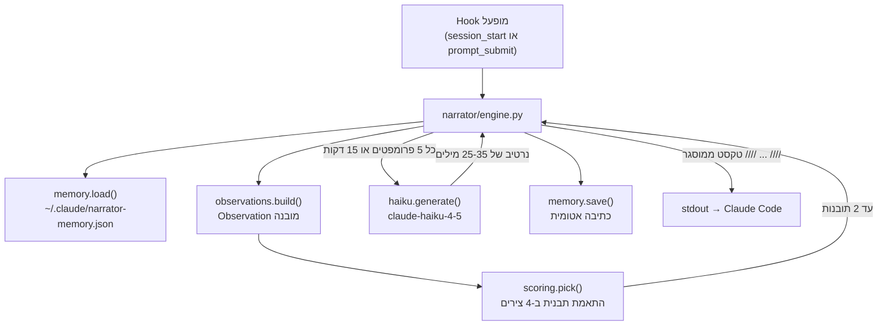

# נרטור

## מטרה

הנרטור היא מערכת תובנות המוזרקת דרך hook שמציגה עצות ניהול הקשר בשפה טבעית מעל הפרומפט הבא של המשתמש. היא קוראת את אותם מדדים שסטטוס הליין מציג ואומרת למשתמש מה המספרים האלה אומרים ומה לעשות לגביהם.

## ארכיטקטורה דו-שכבתית



### שכבה 1: מנוע חוקים

תמיד פעיל, זמן ביצוע תת-50ms, אפס עלות. מערכת הניקוד ב-`narrator/scoring.py` מעריכה תבניות מול [Observation](#observation-dataclass) הנוכחי ומחזירה עד 2 אובייקטי `Insight`.

כל תובנה מקבלת ניקוד על 4 צירים:

| ציר | משקל | טווח | משמעות |
|------|--------|-------|---------|
| דחיפות | x3 | 10=קריטי, 7=אזהרה, 4=מידע, 1=גיבוי | עד כמה רגיש לזמן |
| חידוש | x2 | 10=לא נראה לאחרונה, 0=חוזר | ביטול כפילויות מול 3 הנרטיבים האחרונים |
| יכולת פעולה | x2 | 10=פעולה חזקה, 5=מידע+הצעה, 2=מידע טהור | האם המשתמש יכול לפעול |
| ייחודיות | x1 | 10=עובדה חדשה, 5=מוסיף משמעות, 0=חזרה | האם זה מידע חדש |

ניקוד סופי: `urgency * 3 + novelty * 2 + actionability * 2 + uniqueness * 1`. שתי התובנות בעלות הניקוד הגבוה ביותר מוצגות.

תבניות מכסות 15+ דפוסים: הקשר מתמלא, קצב שריפה גבוה, פעילות מטמון, התקרבות למגבלות תעריף, אבני דרך בעלות ($5/$10/$25/$50/$100), מעברי שיא/מחוץ לשיא.

### שכבה 2: Haiku LLM

אופציונלי, מופעל כאשר `ANTHROPIC_API_KEY` מוגדר. משתמש ב-`claude-haiku-4-5` עם timeout של 5 שניות ופלט מקסימלי של 80 טוקנים. ה-prompt של המערכת מנחה אותו לכתוב 25-35 מילים שמכסות מה השתנה מאז הדוח האחרון ואת התמונה הכללית של הסשן.

תנאי הפעלה: כל 5 פרומפטים או 15 דקות (המוקדם מביניהם), ותמיד בתחילת סשן, compact, או resume. עלות: בערך $0.0005 לקריאה.

שכבת Haiku מקבלת את הבחירה של מנוע החוקים כהקשר, כדי שלא תחזור על מה שהחוקים כבר אמרו.

## Observation dataclass

ה-`Observation` ב-`narrator/observations.py` הוא המקור היחיד לאמת שמוזן גם לניקוד וגם ל-Haiku:

```python
@dataclass
class Observation:
    cost_usd: float           # עלות מצטברת של הסשן
    burn_10m: float | None    # $/שעה חלון מתגלגל של 10 דקות
    burn_session: float | None  # $/שעה ממוצע סשן לכל החיים
    ctx_pct: float            # 0-100% מתוך ההקשר בשימוש
    ctx_mins_left: float | None  # דקות עד שההקשר מלא
    cache_pct: float          # cache_read / total_input * 100
    cache_delta_5m: int | None  # טוקני cache_read ב-5 הדקות האחרונות
    is_peak: bool             # שעות שיא פעילות
    rate_limit_5h_pct: float  # ניצול מגבלת 5 שעות
    rate_limit_7d_pct: float  # ניצול מגבלה שבועית
    session_duration_min: float
    prompt_count: int
    # ... בתוספת דלתאות מגמה (cost_delta_5m, cost_delta_20m, ctx_delta_5m)
```

## זיכרון ורצף חוצה-סשנים

מצב נשמר ב-`~/.claude/narrator-memory.json` עם המבנה הזה:

```json
{
  "current": {
    "session_id": "...",
    "started_at": 1718400000,
    "last_emit_at": 1718400300,
    "last_haiku_at": 1718400600,
    "rolling_observations": [...],
    "delivered_narratives": [...],
    "cost_milestones_hit": [5.0, 10.0],
    "prompt_count": 42
  },
  "prior_sessions": [
    { "session_id": "...", "ended_at": ..., "narratives": [...] }
  ]
}
```

תצפיות נשמרות למשך 2 שעות. נרטיבים שנמסרו מוגבלים ל-8 לכל סשן. סשנים קודמים שומרים על 3 האחרונים עם 5 הנרטיבים המובילים כל אחד. רוטציית סשן קורית כאשר `CLAUDE_SESSION_ID` משתנה.

## ביטול כפילויות חידוש

הפונקציה `_novelty()` ב-`narrator/scoring.py` בודקת האם תבנית כבר הופעלה ב-3 הנרטיבים האחרונים שנמסרו. אם כן, החידוש יורד ל-0, מה שמדכא ביעילות חזרות שכן לחידוש יש משקל x2 בניקוד.

## תמיכה דו-לשונית

כל התבניות נושאות גם `text` (אנגלית) וגם `text_he` (עברית). זיהוי שפה:

1. `STATUSLINE_NARRATOR_LANGS=en` / `=he` / `=en,he` (דריסה מפורשת)
2. `$LC_ALL` / `$LC_MESSAGES` / `$LANG` שמתחילים ב-`he` → עברית
3. ברירת מחדל: אנגלית

הפלט עטוף במסגור `//// -> text ////` להבחנה ויזואלית מהקשר הפרומפט הרגיל.

## שקילות Node.js

`narrator/narrator-node.js` (551 שורות) הוא הסבה מלאה של הנרטור ב-Python למודול יחיד עצמאי. הוא מממש מחדש זיכרון, תצפיות, ניקוד, וקריאת Haiku. ה-hooks של ה-shell מנסים Python קודם, ואז נופלים ל-Node.js.

## ויסות

- מצב `prompt_submit`: מינימום 5 דקות בין שליחות (ניתן להגדרה דרך `STATUSLINE_NARRATOR_THROTTLE_MIN`)
- מצב `session_start`: תמיד שולח (ללא ויסות)
- פקודת `/narrate`: הפעלה ידנית, עוקפת ויסות

## משתני סביבה

| משתנה | ברירת מחדל | השפעה |
|----------|---------|--------|
| `STATUSLINE_NARRATOR_ENABLED` | `1` | מתג כיבוי (`0` מנטרל) |
| `STATUSLINE_NARRATOR_HAIKU` | `auto` | `auto` = פועל אם יש מפתח API |
| `STATUSLINE_NARRATOR_HAIKU_INTERVAL_MIN` | `15` | מקסימום דקות בין קריאות Haiku |
| `STATUSLINE_NARRATOR_THROTTLE_MIN` | `5` | מינימום דקות בין שליחות prompt_submit |
| `STATUSLINE_NARRATOR_LANGS` | זיהוי אוטומטי | `en`, `he`, או `en,he` |
| `ANTHROPIC_API_KEY` | לא מוגדר | מאפשר שכבת Haiku כשנוכח |

## קובצי מקור מרכזיים

| קובץ | מטרה |
|------|---------|
| `narrator/engine.py` | מתאם pipeline: טעינת זיכרון, בניית תצפית, ניקוד, Haiku, שמירה |
| `narrator/scoring.py` | ניקוד ב-4 צירים, 15+ תבניות, ביטול כפילויות |
| `narrator/observations.py` | Observation dataclass ובונה ממצב סשן חי |
| `narrator/haiku.py` | קריאת Anthropic Haiku API אופציונלית |
| `narrator/memory.py` | זיכרון חוצה-סשנים עם כתיבות אטומיות |
| `narrator/narrator-node.js` | הסבה מלאה ל-Node.js של כל ה-pipeline |
| `narrator/cli.js` | עטיפת CLI לנרטור Node.js |
| `narrator/__init__.py` | API ציבורי: `from narrator import run` |
| `hooks/narrator-prompt-submit.sh` | מנתל UserPromptSubmit hook |
| `hooks/narrator-session-start.sh` | מנתל SessionStart hook |
| `hooks/hooks.json` | רישום hook של Claude Code |
| `tests/test_narrator.py` | בדיקות ניקוד, תצפית, ו-pipeline |
| `tests/test_narrator_scoring.py` | בדיקות מפורטות של תבניות ניקוד |
| `tests/test_narrator_memory.py` | בדיקות התמדת זיכרון ורוטציה |

## עמודים קשורים

- [מדדים מתגלגלים](rolling-metrics.md) — נתוני מקור לתצפיות הנרטור
- [Hooks ופקודות](../systems/hooks-and-commands.md) — כיצד hooks מתחברים לנרטור
- [ארכיטקטורת מנועים](../systems/engines.md) — ניתוב Python מול Node לנרטור
