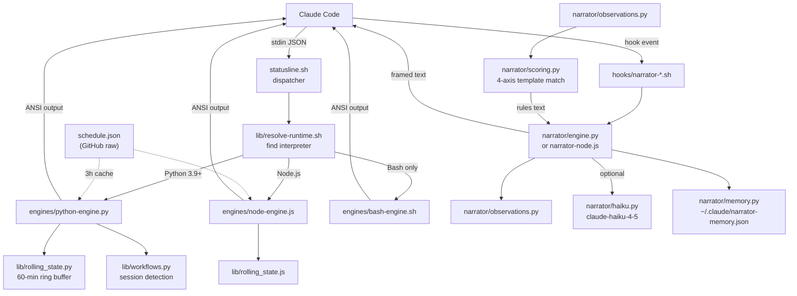

# ארכיטקטורה

למערכת ארבע שכבות: מנתב `runtime`, שלושה מנועי רינדור מקבילים, תת-מערכת מספר (narrator) שמתחברת למחזור החיים של שורת הפקודה ב-Claude Code, ותשתיות תומכות (worker טלמטריה, תוסף VS Code, מתקין).

## זרימת נתונים ברמה הגבוהה

## מנתב ה-runtime

נקודת הכניסה היא `statusline.sh`, שטוען את `lib/resolve-runtime.sh` ומנסה קודם Python, ואז Node.js, ואז נופל חזרה ל-Bash טהור. Claude Code מזרים אובייקט JSON ב-stdin עם מטא-דאטה של הסשן (מודל, חלון קונטקסט, עלות, נתיב התמליל, מצב ה-`git`). המנוע שנבחר קורא את ה-JSON, מרנדר מקטעים צבעוניים ב-ANSI, וכותב ל-stdout. Claude Code מציג את הפלט הזה בתור ה-`statusline`.

## הקבלה בין שלושה מנועים

שלושת המנועים ב-`engines/` אינם מסודרים בשכבות. מדובר במימושים עצמאיים של אותה חבילת פיצ'רים:

| מנוע | שורות | פיצ'רים | runtime |
|--------|-------|----------|---------|
| `engines/python-engine.py` | 1670 | מלא (`statusline` + תמיכת מספר) | Python 3.6+ (3.9+ למספר) |
| `engines/node-engine.js` | 915 | פריטי `statusline` מלא | Node.js LTS |
| `engines/bash-engine.sh` | 406 | מקטעים בסיסיים בלבד | Bash 4+ |

Python ו-Node.js חולקים הגדרות מקטעים ולוגיקת רינדור באופן מושגי, אבל מדובר בשני בסיסי קוד נפרדים. מנוע ה-Bash הוא מוצא אחרון שמרנדר רק את המקטעים של שעות שיא, מודל, קונטקסט ו-`git`.

## תת-מערכת המספר (narrator)

המספר הוא צינור עיבוד נפרד שמופעל על ידי hooks של Claude Code, ולא על ידי מנתב ה-`statusline`. שני סקריפטי hook (`hooks/narrator-session-start.sh` ו-`hooks/narrator-prompt-submit.sh`) נורים בתחילת סשן ובשליחת פקודה. כל אחד מהם מנסה קודם את המספר ב-Python (דרך `narrator/engine.py`), ונופל למימוש Node.js (`narrator/narrator-node.js`).

הצינור: בונים [Observation](../features/narrator.md) מתוך מצב הסשן החי, מריצים את [מנוע הניקוד](../features/narrator.md) כדי לבחור עד 2 תובנות מבוססות תבניות, קוראים אופציונלית ל-Haiku לשורה עשירה שנייה, שומרים מצב ל-`~/.claude/narrator-memory.json`, ופולטים טקסט ממוסגר (`//// ... ////`) ש-Claude Code מציג מעל שורת הפקודה הבאה.

## תשתית תומכת

- **worker טלמטריה** (`worker/worker.js`): Cloudflare Worker עם אחסון KV. מקבל פינגים אנונימיים של התקנה/`heartbeat` ואבחוני doctor. ראו [worker טלמטריה](../apps/telemetry-worker.md).
- **תוסף VS Code** (`vscode/extension.ts`): תוסף TypeScript שקורא נתוני `statusline` חיים מקבצי `~/.claude/` ומרנדר סוללות מגבלת-קצב ומחווני קונטקסט בשורת הסטטוס של העורך. ראו [תוסף VS Code](../apps/vscode-extension.md).
- **מתקין** (`install.sh`, `install.ps1`): התקנה חוצת-פלטפורמות שמזהה את ה-runtime, שואל על העדפת רמה, כותב הגדרות, מחבר hooks, ומושך את ה-schedule ההתחלתי. ראו [צינור המתקין](../systems/installer.md).
- **doctor** (`doctor/doctor.sh`): כלי אבחון בן 1338 שורות שבודק את בריאות ההתקנה ויכול להחיל תיקונים. ראו [אבחון ה-doctor](../features/doctor.md).

## פילוח שפות

| שפה | שורות | תפקיד |
|----------|-------|------|
| Python | ~7,185 | מנועים ראשיים, מספר, ספריות משותפות, בדיקות |
| Markdown | ~6,290 | README (דו-לשוני), changelogs, תיעוד, פקודות, skills |
| Shell/Bash | ~3,320 | מנועים, מתקין, doctor, hooks, wire-json |
| JavaScript | ~2,070 | מנוע Node.js, מימוש מספר, worker, טלמטריה |
| PowerShell | ~1,442 | מתקין Windows, wire-json ל-PS |
| TypeScript | ~742 | תוסף VS Code |
