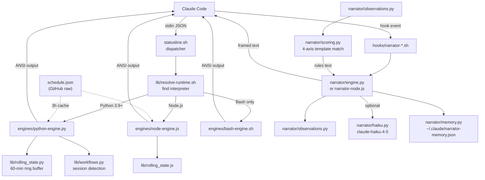

# Architecture

The system has four layers: a runtime dispatcher, three parallel rendering engines, a narrator subsystem that hooks into Claude Code's prompt lifecycle, and supporting infrastructure (telemetry worker, VS Code extension, installer).

## High-level data flow

## Runtime dispatcher

The entry point is `statusline.sh`, which sources `lib/resolve-runtime.sh` and tries Python first, then Node.js, then falls back to pure Bash. Claude Code pipes a JSON object on stdin containing session metadata (model, context window, cost, transcript path, git state). The chosen engine reads this JSON, renders ANSI-colored segments, and writes to stdout. Claude Code displays that output as the statusline.

## Three-engine parallelism

The three engines in `engines/` are not layered. They are independent implementations of the same feature set:

| Engine | Lines | Features | Runtime |
|--------|-------|----------|---------|
| `engines/python-engine.py` | 1670 | Full (statusline + narrator support) | Python 3.6+ (3.9+ for narrator) |
| `engines/node-engine.js` | 915 | Full statusline parity | Node.js LTS |
| `engines/bash-engine.sh` | 406 | Minimal segments only | Bash 4+ |

Python and Node.js share segment definitions and rendering logic conceptually but are separate codebases. The Bash engine is a last resort that renders only peak-hours, model, context, and git segments.

## Narrator subsystem

The narrator is a separate pipeline triggered by Claude Code hooks, not by the statusline dispatcher. Two hook scripts (`hooks/narrator-session-start.sh` and `hooks/narrator-prompt-submit.sh`) fire on session start and prompt submission. Each tries the Python narrator first (via `narrator/engine.py`), falling back to the Node.js port (`narrator/narrator-node.js`).

The pipeline: build an [Observation](../features/narrator.md) from live session state, run the [scoring engine](../features/narrator.md) to pick up to 2 template-based insights, optionally call Haiku for a richer second line, persist state to `~/.claude/narrator-memory.json`, and emit framed text (`//// ... ////`) that Claude Code surfaces above the next prompt.

## Supporting infrastructure

- **Telemetry worker** (`worker/worker.js`): Cloudflare Worker with KV storage. Receives anonymous install/heartbeat pings and doctor diagnostics. See [telemetry worker](../apps/telemetry-worker.md).
- **VS Code extension** (`vscode/extension.ts`): TypeScript extension that reads live statusline data from `~/.claude/` files and renders rate-limit battery bars and context indicators in the editor status bar. See [VS Code extension](../apps/vscode-extension.md).
- **Installer** (`install.sh`, `install.ps1`): Cross-platform setup that detects runtime, asks for tier preference, writes config, wires hooks, and fetches the initial schedule. See [installer pipeline](../systems/installer.md).
- **Doctor** (`doctor/doctor.sh`): 1338-line diagnostic tool that checks installation health and can apply fixes. See [doctor diagnostics](../features/doctor.md).

## Language breakdown

| Language | Lines | Role |
|----------|-------|------|
| Python | ~7,185 | Primary engines, narrator, shared libraries, tests |
| Markdown | ~6,290 | README (bilingual), changelogs, docs, commands, skills |
| Shell/Bash | ~3,320 | Engines, installer, doctor, hooks, wire-json |
| JavaScript | ~2,070 | Node.js engine, narrator port, worker, telemetry |
| PowerShell | ~1,442 | Windows installer, wire-json for PS |
| TypeScript | ~742 | VS Code extension |
